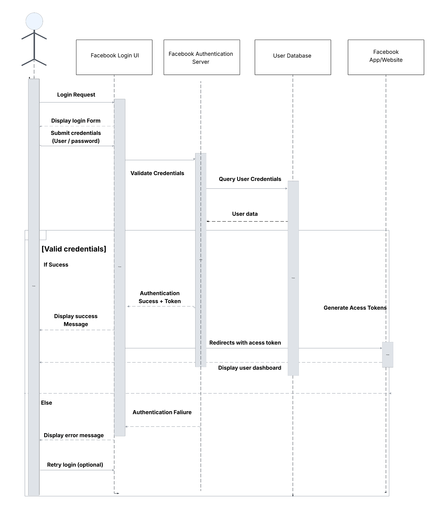
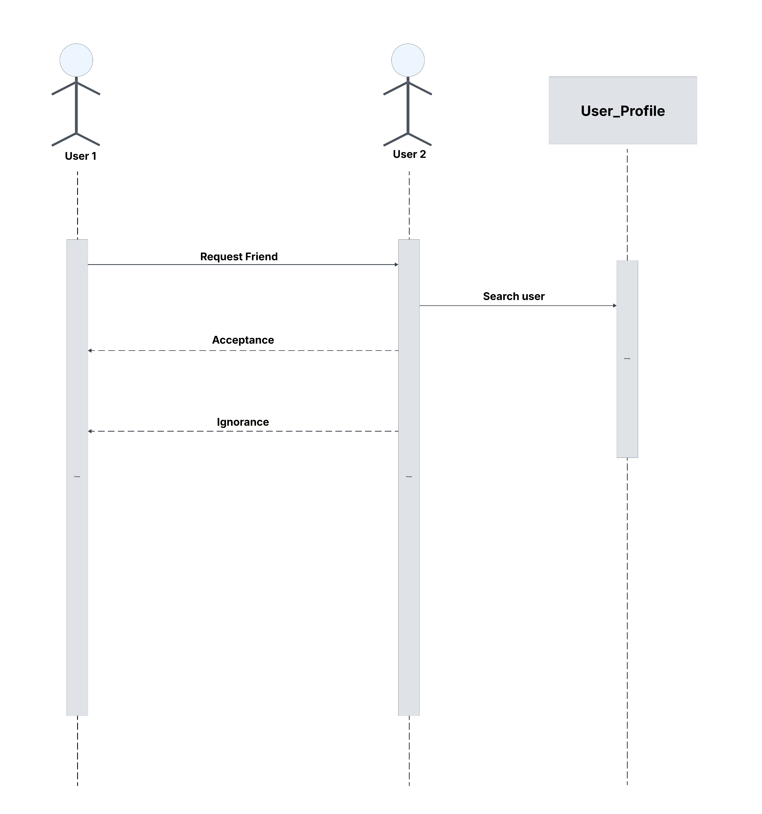

# Facebook Sequence Diagram

A simplified sequence diagram that models the core user interactions on Facebook, such as authentication, posting contents, posting stories, viewing feeds and managing user accounts.

## Table of Contents
- [Overview](#overview)
- [Diagrams Included](#diagrams-included)
- [Tools Used](#tools-used)
- [How to View the Diagram](#how-to-view-the-diagram)

## Overview

This repository contains a sequence diagram that illustrates the interactions between users and the Facebook platform. The diagram is designed to provide a clear and concise representation of the core functionalities of Facebook, including user authentication, posting content, viewing feeds, and managing user accounts.

## Diagrams Included

### **User Authentication**

### **Sending Friend Request**

## Tools Used

- [Lucid Chart](https://www.lucidchart.com/pages/landing?km_CPC_CampaignId=1484560207&km_CPC_AdGroupID=60168114191&km_CPC_Keyword=lucid%20chart&km_CPC_MatchType=e&km_CPC_ExtensionID=&km_CPC_Network=g&km_CPC_AdPosition=&km_CPC_Creative=442433234360&km_CPC_TargetID=kwd-55720648523&km_CPC_Country=9075456&km_CPC_Device=c&km_CPC_placement=&km_CPC_target=)

- [Miro](https://miro.com)

## How to View the Diagram

### **User Authentication**

**User** – tries to log in

**Login UI** – shows the login form

**Auth Server** – checks the login info

**User Database** – stores usernames and passwords

**Facebook App** – the app or site user logs into

### **Steps:**

1. User clicks "Login" → Login UI shows the form.

2. User enters username & password → Login UI sends it to Auth Server.

3. Auth Server checks the info with the User Database.

If correct:

3. Auth Server creates an access token

4. Sends success back to Login UI

5. User is redirected to Facebook App → sees their dashboard

If wrong:

6. Auth Server sends failure

7. Login UI shows an error

8. User can try again

### **Sending Friend Request**

**User** – sends a friend request and can view other profile

**Profile Server** - Serves the profile page

### **Steps:**

1. User clicks "Send Friend Request" → Profile Server receives the request.
2. Other user can either
   - Accept the request
   - Decline the request
3. If accepted they become friends and user get notification.
4. If declined, the request is removed

