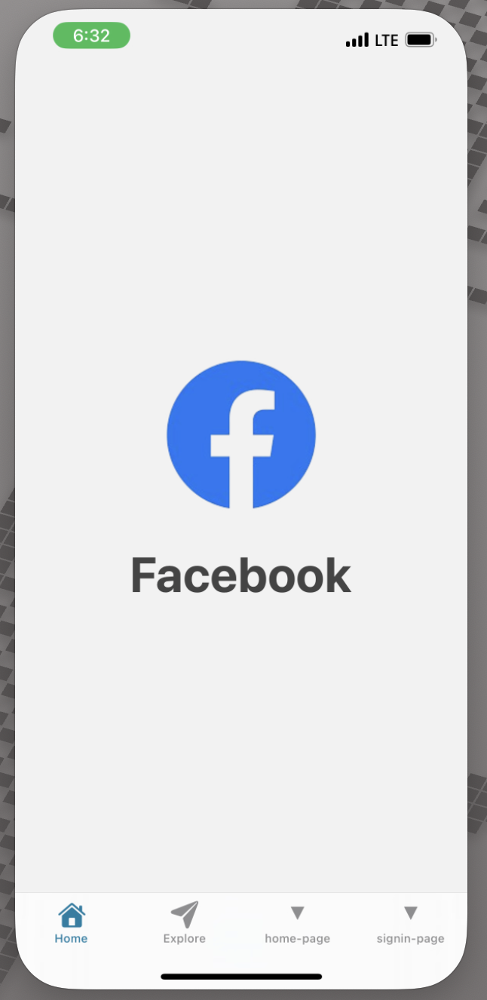
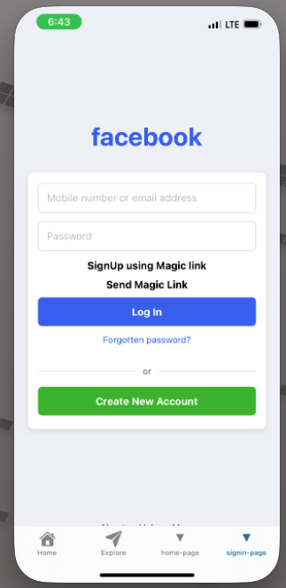
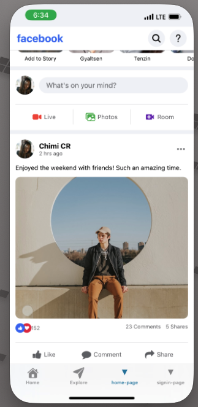
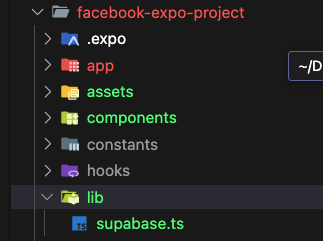

# Facebook Magic Link Auth - React Native App

This is a React Native project that demonstrates how to implement a **magic link authentication** system using **Supabase**. The app also includes a custom **Facebook-themed splash screen**, a **signup page**, and a **home page** for logged-in users.

## ✨ Features

- 🚀 Facebook-themed Splash Screen
- 🔐 Magic Link Signup via Supabase Auth
- 📥 Signup Page for User Registration
- 🏠 Home Page (Post-login)
- 📱 Built with React Native (Expo)

## 🛠 Tech Stack

- **React Native** (Expo)
- **Supabase** (Auth)
- **Magic Link Authentication**
- **React Navigation** for navigation between screens

## 📸 Screens

| Splash Screen | Signup Page | Home Page |
|---------------|-------------|-----------|
|  |  |  |

## Step By Step Implementation

1. **Create a new Expo project**:
   ```bash
   npx create-expo-app facebook-magic-link-auth
   cd facebook-magic-link-auth
   ```
2. **Install dependencies**:
   ```bash
   npm install @react-navigation/native @react-navigation/native-stack react-native-gesture-handler react-native-reanimated react-native-screens react-native-safe-area-context @react-native-community/masked-view
   ```
3. **Install Supabase**:
   ```bash
   npm install @supabase/supabase-js
   ```
4. **Set up Supabase**:
   - Create a new Supabase project at [Supabase](https://supabase.io/).
   - Enable **Email Auth** in the Supabase dashboard.
   - Copy your Supabase URL and Anon Key.
5. Create home screen, signup screen, and splash screen components.

| Splash Screen | Signup Page | Home Page |
|---------------|-------------|-----------|
|  |  |  |

6. Create a helper file lib/supabase.ts to initialize Supabase.

   [You can follow this docs for creating a helper file](https://supabase.com/docs/guides/auth/quickstarts/react-native)

   

   Add your Supabase URL and Anon Key in the helper file.

7. Implement the logic for magic link authentication in the signup screen. [Docs](https://supabase.com/docs/guides/auth/auth-email-passwordless?queryGroups=language&language=react-native)

   A magic link lets users log in by clicking a link sent to their email—no password needed.


