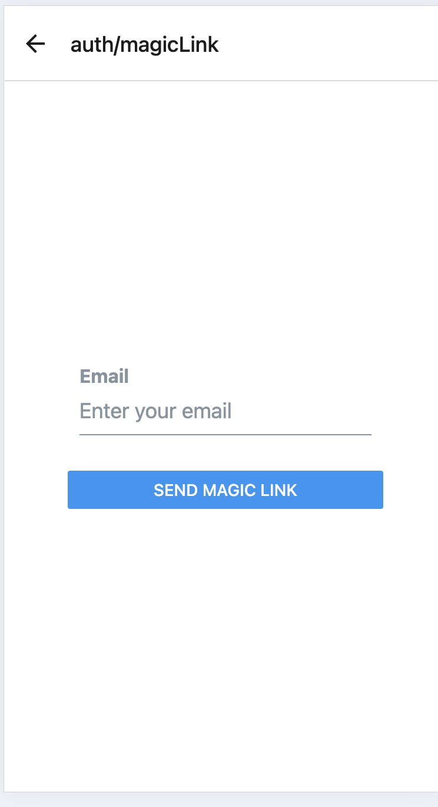

# Authentication & Authorization

## **Initial Setup for Superbase Auth with React Native**

1. **Create a new project in Superbase.**
   
- Launch a new project in the Supabase Dashboard.

   **Example :**
   

- Install the Supabase client library.

   ```bash
   expo install @supabase/supabase-js @react-native-async-storage/async-storage @rneui/themed react-native-url-polyfill
   ```

   ```bash
   cd my-app
   ```

- Set up your login component.

   Create a helper file `lib/superbase.ts` 

   ```typescript
   import { AppState } from 'react-native'
   import 'react-native-url-polyfill/auto'
   import AsyncStorage from '@react-native-async-storage/async-storage'
   import { createClient } from '@supabase/supabase-js'

   const supabaseUrl = YOUR_REACT_NATIVE_SUPABASE_URL
   const supabaseAnonKey = YOUR_REACT_NATIVE_SUPABASE_ANON_KEY

   export const supabase = createClient(supabaseUrl, supabaseAnonKey, {
   auth: {
      storage: AsyncStorage,
      autoRefreshToken: true,
      persistSession: true,
      detectSessionInUrl: false,
   },
   })

   AppState.addEventListener('change', (state) => {
   if (state === 'active') {
      supabase.auth.startAutoRefresh()
   } else {
      supabase.auth.stopAutoRefresh()
   }
   })
   ```

   Change `supabaseUrl` and `supabaseAnonKey` with your Supabase project URL and Anon key from superbase project.

- Set up your login component

   Create **`components/Auth.tsx`**

   Let's set up a React Native component to manage logins and sign ups.

   ```typescript

   import React, { useState } from 'react'
   import { Alert, StyleSheet, View } from 'react-native'
   import { supabase } from '../lib/supabase'
   import { Button, Input } from '@rneui/themed'

   export default function Auth() {
   const [email, setEmail] = useState('')
   const [password, setPassword] = useState('')
   const [loading, setLoading] = useState(false)

   async function signInWithEmail() {
      setLoading(true)
      const { error } = await supabase.auth.signInWithPassword({
         email: email,
         password: password,
      })

      if (error) Alert.alert(error.message)
      setLoading(false)
   }

   async function signUpWithEmail() {
      setLoading(true)
      const {
         data: { session },
         error,
      } = await supabase.auth.signUp({
         email: email,
         password: password,
      })

      if (error) Alert.alert(error.message)
      if (!session) Alert.alert('Please check your inbox for email verification!')
      setLoading(false)
   }

   return (
      <View style={styles.container}>
         <View style={[styles.verticallySpaced, styles.mt20]}>
         <Input
            label="Email"
            leftIcon={{ type: 'font-awesome', name: 'envelope' }}
            onChangeText={(text) => setEmail(text)}
            value={email}
            placeholder="email@address.com"
            autoCapitalize={'none'}
         />
         </View>
         <View style={styles.verticallySpaced}>
         <Input
            label="Password"
            leftIcon={{ type: 'font-awesome', name: 'lock' }}
            onChangeText={(text) => setPassword(text)}
            value={password}
            secureTextEntry={true}
            placeholder="Password"
            autoCapitalize={'none'}
         />
         </View>
         <View style={[styles.verticallySpaced, styles.mt20]}>
         <Button title="Sign in" disabled={loading} onPress={() => signInWithEmail()} />
         </View>
         <View style={styles.verticallySpaced}>
         <Button title="Sign up" disabled={loading} onPress={() => signUpWithEmail()} />
         </View>
      </View>
   )
   }

   const styles = StyleSheet.create({
   container: {
      marginTop: 40,
      padding: 12,
   },
   verticallySpaced: {
      paddingTop: 4,
      paddingBottom: 4,
      alignSelf: 'stretch',
   },
   mt20: {
      marginTop: 20,
   },
   })

   ```

## **Password based Auth** 

- **Enable Email/Password Auth in Supabase.**
- Go to your Supabase project dashboard.
- Navigate to **Authentication** > **Sign In/Up** > **Auth Providers**.
- Enable **Email** authentication.

   
- Made two input field for email and password.
   
- Made two buttons for login and signup.
   
- On click of login button, call the `signInWithEmail` function.
   
- On click of signup button, call the `signUpWithEmail` function.
   

## **Magic Link**

- **Passwordless authentication** is a way to log in without using a password. Instead, users verify their identity with:

   - **Email link** (magic link)

   - **Biometrics** (like fingerprint or face ID)

- **Enable Phone Auth in Supabase.**

   

- On clicking on the `Use Magic Link` button, redirect the user to a new screen `/auth/magicLink`.

   

- On entering the email and clicking on the `Send Magic Link` button, call the `signInWithMagicLink` function.

   

